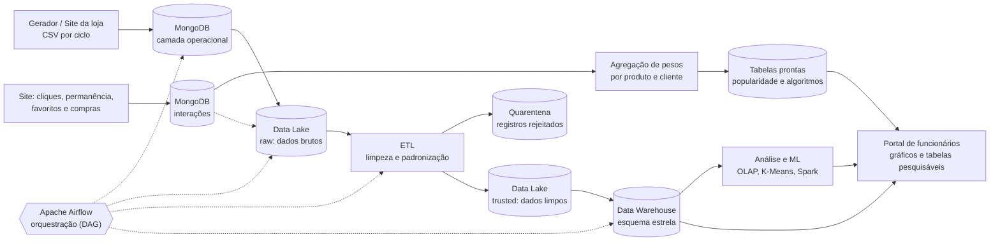
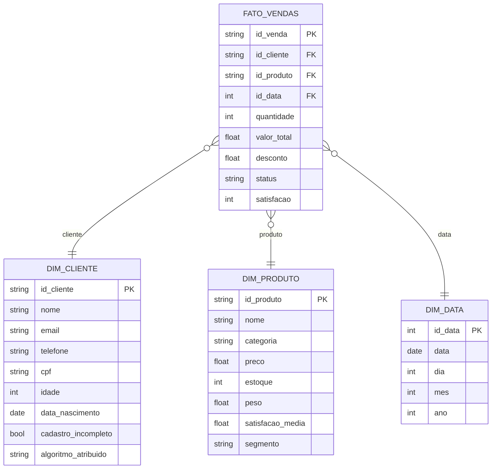
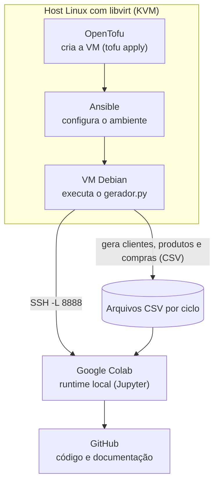

# Projeto Gardênia

Solução de dados desenvolvida para a loja de roupas **Gardênia**, com o objetivo de melhorar o processo de vendas, o controle de estoque e o armazenamento das informações da empresa.

O projeto consiste em um site de compras para retirada na loja, desenvolvido com HTML, CSS e Python, utilizando o MongoDB para armazenamento dos dados. Este repositório documenta a parte de dados do projeto (Big Data / Data Science): geração e coleta, armazenamento, limpeza, ETL, análise e Machine Learning.

## Sumário

1. [Descrição](#descrição)
2. [Situação-problema](#situação-problema)
3. [Solução](#solução)
4. [Base de dados e gerador](#base-de-dados-e-gerador)
5. [Os 5 Vs do Big Data no projeto](#os-5-vs-do-big-data-no-projeto)
6. [Arquitetura de dados](#arquitetura-de-dados)
7. [Estratégias de limpeza dos dados](#estratégias-de-limpeza-dos-dados)
8. [Sistema de algoritmo de cliques](#sistema-de-algoritmo-de-cliques)
9. [Portal de funcionários](#portal-de-funcionários)
10. [Tecnologias e justificativas](#tecnologias-e-justificativas)
11. [Infraestrutura](#infraestrutura)
12. [Como reproduzir o ambiente](#como-reproduzir-o-ambiente)
13. [Estrutura do repositório](#estrutura-do-repositório)
14. [Entregáveis da disciplina de Big Data](#entregáveis-da-disciplina-de-big-data)

---

## Descrição

O sistema permitirá que os clientes consultem os produtos disponíveis, visualizem as roupas pela frente e pelo verso e tenham acesso a informações como marca e material. Também haverá um sistema de clientes, no qual o comprador poderá informar seu CPF para ter acesso a descontos e benefícios exclusivos do site e da loja.

## Situação-problema

Atualmente, a loja utiliza arquivamento em papel para registrar algumas de suas informações e não possui um sistema centralizado para armazenar os dados de cada compra. Isso dificulta a consulta e a organização das informações, além de prejudicar o controle de estoque, o acompanhamento das vendas e o conhecimento sobre os clientes.

A falta de armazenamento adequado dos dados também representa um gasto de oportunidade, pois informações importantes sobre as compras e os clientes deixam de ser aproveitadas para gerar análises e auxiliar nas decisões da loja.

## Solução

Será desenvolvido um site de compras para retirada na loja, permitindo que os clientes consultem os produtos e realizem seus pedidos de forma digital. O sistema contará também com um portal para funcionários, com análise de vendas, caixa virtual, pesquisa de clientes e controle de estoque.

Os dados de produtos, clientes e compras serão armazenados no MongoDB. O sistema de clientes identificará compradores por meio do CPF e oferecerá descontos exclusivos.

Fluxo dos dados:

- **Registro:** quando um cliente realiza uma compra pelo site, os dados do pedido são registrados no sistema operacional (produto, quantidade, preço, desconto, cliente, data e situação do pedido).
- **Data Lake:** os dados são enviados para o Data Lake, onde permanecem no formato original. Isso mantém um histórico das operações, mesmo que os dados sejam modificados ou tratados depois.
- **ETL:** os dados passam por verificações de qualidade (compras duplicadas, valores inválidos, produtos inexistentes, dados cadastrais inconsistentes) e por padronização de formatos.
- **Data Warehouse:** após o tratamento, os dados são organizados no modelo dimensional. A tabela `Fato_Vendas` armazena os registros das vendas, e as dimensões `Dim_Cliente`, `Dim_Produto` e `Dim_Data` fornecem o contexto para a análise. Isso permite consultas específicas sem analisar diretamente os dados brutos do Data Lake.

Além do fluxo de vendas, o sistema registra as **interações dos clientes com os produtos** (clique, permanência, favorito e compra). Esses dados alimentam o [sistema de algoritmo de cliques](#sistema-de-algoritmo-de-cliques), que atribui a cada cliente um perfil de recomendação.

Todos os resultados, tanto os analíticos (vendas, clientes, estoque) quanto os do algoritmo de cliques, são exibidos no [portal de funcionários](#portal-de-funcionários), em gráficos e tabelas pesquisáveis.

Com a solução, a loja reduz a dependência de registros em papel, melhora a organização das informações, facilita o processo de compra e passa a ter uma visão mais clara das vendas, dos clientes e do estoque.

## Base de dados e gerador

Como a loja ainda registra tudo em papel, não há histórico digital. Por isso a base do projeto é **gerada pelo próprio sistema**, com o script `gerador/gerador.py` (classe `SimuladorDados`), executado na VM. No ambiente simulado, o gerador faz o papel do site: produz os registros operacionais que alimentam o MongoDB e o Data Lake.

> O gerador grava arquivos CSV. A carga desses CSV no MongoDB e no Data Lake faz parte da arquitetura proposta e não é feita pelo script.

### Como o gerador funciona

- Ao iniciar, pede a **taxa de consistência** (0 a 100). Com 100, nenhum dado é corrompido; com 0, todos os registros recebem alguma inconsistência.
- Roda em **loop contínuo** (pausa de 3 segundos entre ciclos, interrompido com `CTRL + C`).
- Cada ciclo gera **5.000 clientes, 5.000 produtos e 5.000 compras** (15.000 registros) e salva três arquivos: `clientes_N.csv`, `produtos_N.csv` e `compras_N.csv`, onde `N` é o número do ciclo.
- Ao final de cada ciclo, imprime um relatório com tempo de geração e taxa de consistência por tipo de dado.
- Cada registro tem a coluna booleana `inconsistente`, que indica se ele foi corrompido de propósito.

### Dicionário de dados

**`clientes_N.csv`**

| Coluna | Tipo | Descrição | Regra de valor válido |
|---|---|---|---|
| `id` | inteiro | Identificador do cliente (reinicia em 1 a cada ciclo) | inteiro positivo |
| `nome` | texto | Nome e sobrenome | não vazio |
| `email` | texto | E-mail | formato `usuario@dominio` |
| `idade` | inteiro | Idade em anos | 18 a 100 |
| `telefone` | texto | Telefone celular | `(DD) 9XXXX-XXXX` |
| `cpf` | texto | CPF do cliente (base dos descontos) | `XXX.XXX.XXX-XX` |
| `data_nascimento` | data | Data de nascimento | no passado |
| `data_cadastro` | data/hora | Momento da geração do ciclo | ISO 8601 |
| `inconsistente` | booleano | Marcador do gerador | só para auditoria |

**`produtos_N.csv`**

| Coluna | Tipo | Descrição | Regra de valor válido |
|---|---|---|---|
| `id` | inteiro | Identificador do produto (reinicia a cada ciclo) | inteiro positivo |
| `nome` | texto | Nome do produto | não vazio |
| `categoria` | texto | Categoria | uma das 7 categorias do domínio |
| `preco` | decimal | Preço em R$ | maior que 0 |
| `estoque` | inteiro | Unidades em estoque | maior ou igual a 0 |
| `peso` | decimal | Peso em kg | maior que 0 |
| `satisfacao_media` | decimal | Nota média | 0 a 5 |
| `data_cadastro` | data/hora | Momento da geração do ciclo | ISO 8601 |
| `inconsistente` | booleano | Marcador do gerador | só para auditoria |

**`compras_N.csv`**

| Coluna | Tipo | Descrição | Regra de valor válido |
|---|---|---|---|
| `id` | inteiro | Identificador da compra (reinicia a cada ciclo) | inteiro positivo |
| `cliente_id` | inteiro | Chave para o cliente | existe em `clientes` |
| `produto_id` | inteiro | Chave para o produto | existe em `produtos` |
| `quantidade` | inteiro | Itens comprados | maior que 0 |
| `valor_total` | decimal | Valor da compra em R$ | maior que 0 |
| `desconto` | decimal | Desconto em R$ | de 0 até `valor_total` |
| `data_compra` | data/hora | Data da compra | não futura |
| `status` | texto | Situação do pedido | `pendente`, `pago`, `enviado`, `entregue` ou `cancelado` |
| `satisfacao` | inteiro | Nota do cliente | 1 a 5 |
| `inconsistente` | booleano | Marcador do gerador | só para auditoria |

### Limitações da base

- **Chaves repetidas entre ciclos:** os `id` reiniciam em 1 a cada ciclo. Ao juntar vários arquivos, é preciso criar uma chave composta (`lote` + `id`), onde `lote` vem do número no nome do arquivo.
- **Domínio dos produtos:** as categorias e nomes (Eletrônicos, Alimentos, Livros etc.) não são de uma loja de roupas, e não há `marca`, `material` nem `funcionario`. Por isso o modelo dimensional abaixo não tem `Dim_Funcionario`. Uma melhoria é ajustar as listas do gerador para categorias de moda.
- **Valores independentes:** `valor_total` é sorteado e não é calculado a partir de `preco` x `quantidade`, então essa relação não pode ser usada como regra de validação.
- **CPFs sintéticos:** os CPFs são números aleatórios e não passam no cálculo dos dígitos verificadores. Na simulação, validamos apenas o formato.
- **Sem duplicatas injetadas:** o gerador não cria compras duplicadas. A deduplicação serve de salvaguarda, por exemplo contra o reprocessamento do mesmo arquivo.
- **Sem dados de cliques:** o gerador não produz eventos de interação (clique, permanência, favorito) nem o campo `segmento` dos produtos, necessários ao [sistema de algoritmo de cliques](#sistema-de-algoritmo-de-cliques). Esses dados vêm do site; para testar o portal antes do site ficar pronto, uma melhoria é estender o gerador com um arquivo `eventos_N.csv`.

## Os 5 Vs do Big Data no projeto

| V | Como aparece no projeto |
|---|---|
| **Volume** | Cada ciclo gera 15.000 registros; em operação contínua os arquivos se acumulam rapidamente |
| **Velocidade** | Novo lote a cada poucos segundos, simulando o fluxo contínuo de compras |
| **Variedade** | Três entidades (clientes, produtos, compras) com textos, números, datas e identificadores |
| **Veracidade** | A taxa de consistência é configurável; os dados chegam com erros de formato, valor e integridade |
| **Valor** | Segmentação de clientes (K-Means), descontos direcionados e decisões de estoque |

## Arquitetura de dados



### Modelo dimensional (esquema estrela)



> As chaves `id_venda`, `id_cliente` e `id_produto` são compostas por `lote` + `id`, por causa da repetição de ids entre ciclos. As colunas seguem os campos produzidos pelo `gerador.py`.

## Estratégias de limpeza dos dados

O gerador injeta de propósito os erros que a loja enfrentaria com dados reais. A limpeza roda na etapa de ETL (Airflow + `pandas`; em volumes maiores, Spark) e transforma a zona `raw` do Data Lake na zona `trusted`.

### Princípios

1. **Nunca alterar o `raw`.** A limpeza lê o dado bruto e grava o resultado em outra zona. Assim o histórico original é preservado e o processo pode ser refeito.
2. **Três destinos para cada problema:**
   - **Corrigir:** quando o valor correto pode ser recuperado com segurança (capitalização, erros de digitação, `@` faltando).
   - **Anular e sinalizar:** quando o campo é inválido, mas o registro ainda tem valor (campo vira nulo e a linha ganha um marcador).
   - **Quarentena:** quando o registro quebra a integridade ou distorce as métricas (valores negativos, chaves inexistentes). Ele vai para a zona `quarentena` com o `motivo_rejeicao`, sem entrar no Data Warehouse.
3. **Registrar tudo.** Cada regra aplicada gera contadores (corrigidos, anulados, rejeitados) para o relatório de qualidade.
4. **Não usar a coluna `inconsistente` na limpeza nem no modelo.** Ela é o "gabarito" do gerador. Usá-la como regra seria trapacear, e usá-la como variável do K-Means causaria vazamento de informação. Ela serve apenas para **auditar** a limpeza (veja abaixo).

### Regras por entidade

**Clientes**

| Problema gerado | Estratégia | Ação |
|---|---|---|
| Nome com capitalização errada (`JOÃO SILVA`, `joão silva`, `jOãO sIlVa`) | Remover espaços extras e aplicar `str.title()` | Corrigir |
| E-mail sem `@` | Reinserir o `@` antes do domínio (`email.com`) quando o padrão for reconhecível | Corrigir |
| E-mail inválido (`email@`, `@sem_dominio`, com espaços, vazio) | Validar com expressão regular | Anular e sinalizar |
| Idade inválida (-5, 0, 150, 200, nula) | Recalcular a idade a partir de `data_nascimento`; se não for possível, aplicar a faixa 18 a 100 | Corrigir ou anular |
| Data de nascimento no futuro | Comparar com a data atual | Anular (mantém a idade) |
| Telefone inválido (`123`, letras, vazio) | Expressão regular `(DD) 9XXXX-XXXX` | Anular e sinalizar |
| CPF inválido (`123`, só dígitos, 14 dígitos, vazio) | Validar o formato `XXX.XXX.XXX-XX` e rejeitar sequências repetidas | Anular e sinalizar |
| Campos vazios (e-mail, telefone e CPF nulos) | Marcar `cadastro_incompleto = True` | Manter, sem acesso a desconto por CPF |

**Produtos**

| Problema gerado | Estratégia | Ação |
|---|---|---|
| Nome com capitalização errada | Normalizar com `str.title()` e conferir contra a lista de nomes conhecidos | Corrigir |
| Nome vazio, `" "` ou nulo | Remover espaços e testar vazio | Quarentena (produto sem identificação) |
| Preço negativo ou zero | Regra `preco > 0` | Quarentena (distorce receita) |
| Estoque negativo | Regra `estoque >= 0` | Anular e sinalizar (não corrigir para 0, para não esconder o problema) |
| Categoria inválida (vazia, nula, número, inexistente) | Comparar com o domínio de categorias | Anular e sinalizar |
| Peso negativo | Regra `peso > 0` | Anular e sinalizar |
| Satisfação fora de 0 a 5 | Regra de faixa | Anular e sinalizar |

**Compras**

| Problema gerado | Estratégia | Ação |
|---|---|---|
| Status com capitalização errada (`PAGO`, `Pago`) | `strip()` + `lower()` | Corrigir |
| Status com erro de digitação (`pedente`, `etregue`, `canceladu`) | Remover pontuação e espaços e aproximar do valor oficial por similaridade de texto (`difflib.get_close_matches`) | Corrigir; sem correspondência vai para quarentena |
| Cliente inexistente (`cliente_id` entre 90.000 e 99.999) | Anti-join com a dimensão de clientes limpa | Quarentena |
| Produto inexistente | Anti-join com a dimensão de produtos limpa | Quarentena |
| Quantidade negativa | Regra `quantidade > 0` | Quarentena |
| Valor total negativo | Regra `valor_total > 0` | Quarentena |
| Desconto maior que o valor total | Regra `desconto <= valor_total` | Quarentena |
| Data de compra no futuro | Comparar com a data atual | Quarentena |
| Satisfação fora de 1 a 5 ou nula | Regra de faixa | Anular e sinalizar |

### Checagens transversais

- **Chave composta:** criar `lote` a partir do nome do arquivo e usar `lote` + `id` como chave, evitando que registros de ciclos diferentes se misturem.
- **Duplicidade:** remover linhas repetidas pela chave composta (`drop_duplicates`). Isso torna a carga **idempotente**: processar o mesmo arquivo duas vezes não duplica vendas.
- **Integridade referencial:** limpar clientes e produtos antes de compras, porque a validação das chaves depende das dimensões limpas.
- **Tipos:** converter datas com `pd.to_datetime(errors="coerce")` e números com `pd.to_numeric(errors="coerce")`. Valores impossíveis viram nulos em vez de quebrar o pipeline.
- **Valores nulos restantes:** para métricas de produto (peso, satisfação), pode-se imputar a mediana por categoria se a análise exigir; a decisão deve ser documentada no notebook.

### Exemplo de implementação (pandas)

```python
import difflib
import re
import pandas as pd

STATUS_VALIDOS = ["pendente", "pago", "enviado", "entregue", "cancelado"]
REGEX_EMAIL = r"^[^@\s]+@[^@\s]+\.[^@\s]+$"
REGEX_TEL = r"^\(\d{2}\) 9\d{4}-\d{4}$"
REGEX_CPF = r"^\d{3}\.\d{3}\.\d{3}-\d{2}$"


def normalizar_status(valor):
    if not isinstance(valor, str):
        return None
    limpo = re.sub(r"[^a-z]", "", valor.strip().lower())
    achado = difflib.get_close_matches(limpo, STATUS_VALIDOS, n=1, cutoff=0.7)
    return achado[0] if achado else None


def limpar_clientes(df):
    df = df.copy()
    df["nome"] = df["nome"].str.strip().str.title()
    # reinsere o "@" quando o e-mail termina em "email.com" sem arroba
    df["email"] = df["email"].str.replace(r"^(\S+?)email\.com$", r"\1@email.com", regex=True)
    df.loc[~df["email"].fillna("").str.match(REGEX_EMAIL), "email"] = None
    df.loc[~df["telefone"].fillna("").str.match(REGEX_TEL), "telefone"] = None
    df.loc[~df["cpf"].fillna("").str.match(REGEX_CPF), "cpf"] = None
    nasc = pd.to_datetime(df["data_nascimento"], errors="coerce")
    nasc = nasc.where(nasc <= pd.Timestamp.now())
    df["data_nascimento"] = nasc
    idade_calc = ((pd.Timestamp.now() - nasc).dt.days // 365).astype("Int64")
    df["idade"] = idade_calc.where(idade_calc.between(18, 100))
    df["cadastro_incompleto"] = df[["email", "telefone", "cpf"]].isna().any(axis=1)
    return df.drop(columns=["inconsistente"])


def limpar_compras(df, clientes_ok, produtos_ok):
    df = df.copy()
    df["status"] = df["status"].map(normalizar_status)
    df["data_compra"] = pd.to_datetime(df["data_compra"], errors="coerce")
    df["satisfacao"] = df["satisfacao"].where(df["satisfacao"].between(1, 5))
    motivos = pd.Series("", index=df.index)
    motivos[~df["cliente_id"].isin(clientes_ok)] += "cliente_inexistente;"
    motivos[~df["produto_id"].isin(produtos_ok)] += "produto_inexistente;"
    motivos[df["quantidade"] <= 0] += "quantidade_invalida;"
    motivos[df["valor_total"] <= 0] += "valor_invalido;"
    motivos[df["desconto"] > df["valor_total"]] += "desconto_maior_que_valor;"
    motivos[df["data_compra"] > pd.Timestamp.now()] += "data_futura;"
    motivos[df["status"].isna()] += "status_irreconhecivel;"
    df["motivo_rejeicao"] = motivos
    validas = df[df["motivo_rejeicao"] == ""].drop(columns=["motivo_rejeicao", "inconsistente"])
    quarentena = df[df["motivo_rejeicao"] != ""]
    return validas, quarentena
```

> O exemplo mostra o essencial; no notebook, `clientes_ok` e `produtos_ok` devem conter as chaves compostas (`lote` + `id`) dos registros já limpos.

### Como medir se a limpeza funcionou

1. **Relatório de qualidade antes e depois:** percentual de nulos, valores fora de faixa e categorias inválidas em cada coluna, na zona `raw` e na `trusted`.
2. **Contadores por regra:** quantos registros foram corrigidos, anulados ou enviados à quarentena em cada regra.
3. **Auditoria com o gabarito:** usar a coluna `inconsistente` só para comparar. Entre os registros que o gerador marcou como inconsistentes, qual fração foi corrigida, anulada ou rejeitada? Entre os marcados como consistentes, houve rejeições indevidas (falsos positivos)? Registros com erro apenas de capitalização aparecem como "inconsistentes" no gabarito, mas devem ser **recuperados**, não rejeitados.
4. **Teste de estresse com a taxa de consistência:** rodar o gerador com valores como 100, 80 e 50 e verificar se o pipeline mantém o mesmo comportamento e se as proporções de correção e rejeição acompanham a taxa configurada.

## Sistema de algoritmo de cliques

O site registra como cada cliente interage com os produtos e, a partir disso, atribui a ele um **algoritmo** (perfil de recomendação). Esses dados nascem **já formatados**: são gravados pelo próprio site em formato final, por isso **não passam pelas regras de limpeza** da seção anterior. O que importa é que sejam **digeríveis em tabelas e gráficos**.

### Pesos das interações

| Interação | Peso |
|---|---|
| Clicar no produto | 0,1 |
| Permanecer no produto por mais de 10 segundos | 0,2 |
| Favoritar o produto | 0,3 |
| Comprar o produto | 0,5 |

### Regra de atribuição do algoritmo

1. Cada interação soma seu peso ao **peso total do cliente** e ao **peso do segmento** do produto interagido.
2. Quando o peso total do cliente chega a **0,5**, ele recebe um algoritmo baseado no que interagiu. Uma compra, sozinha, já atinge esse limiar.
3. Se as interações forem de **mais de um segmento**, o algoritmo é **misto**.
4. O algoritmo é **recalculado a cada nova interação**, então o perfil acompanha a mudança de comportamento do cliente.

| Algoritmo | Código | Observação |
|---|---|---|
| Masculino | `masculino` | |
| Feminino | `feminino` | |
| Masculino esportivo | `masculino_esportivo` | |
| Feminino esportivo | `feminino_esportivo` | |
| Infantil feminino | `infantil_feminino` | somente se a loja tiver a linha |
| Infantil masculino | `infantil_masculino` | somente se a loja tiver a linha |
| Misto | `misto` | combinação de dois ou mais segmentos |

Para isso funcionar, cada produto precisa ter o campo `segmento` com um dos seis valores acima.

### Fluxo dos dados

1. O site grava cada interação como um **evento** no MongoDB.
2. A cada evento, os pesos são somados de forma atômica nas tabelas de **popularidade do produto** e de **perfil do cliente**.
3. Os eventos também seguem para a zona `raw` do Data Lake, mantendo o histórico completo.
4. O portal de funcionários lê as tabelas prontas, sem etapa de ETL no caminho.

### Modelo de dados

**`eventos_interacao`** (um documento por interação)

| Campo | Tipo | Descrição |
|---|---|---|
| `id_evento` | texto | Identificador único |
| `id_cliente` | inteiro | Cliente que interagiu |
| `id_produto` | inteiro | Produto da interação |
| `tipo_evento` | texto | `clique`, `permanencia`, `favorito` ou `compra` |
| `peso` | decimal | Peso da interação (0,1 / 0,2 / 0,3 / 0,5) |
| `segmento_produto` | texto | Segmento do produto no momento do evento |
| `data_hora` | data/hora | Momento da interação |

**`perfil_cliente`** (um documento por cliente)

| Campo | Tipo | Descrição |
|---|---|---|
| `id_cliente` | inteiro | Cliente |
| `peso_total` | decimal | Soma de todos os pesos do cliente |
| `pesos_segmento` | objeto | Peso acumulado por segmento |
| `algoritmo` | texto | Algoritmo atribuído (vazio até chegar a 0,5) |
| `atualizado_em` | data/hora | Última interação |

**`popularidade_produto`** (um documento por produto) é a tabela que o portal exibe:

| ID produto | Produto | Peso acumulado | Total de cliques | Total de compras | Total de favoritos | Ranking de popularidade |
|---|---|---|---|---|---|---|
| 12 | Camiseta Esportiva Masculina | 16,5 | 58 | 9 | 14 | 1 |
| 31 | Vestido Floral | 11,0 | 40 | 6 | 10 | 2 |
| 07 | Legging Esportiva | 7,9 | 35 | 3 | 7 | 3 |

> Valores fictícios, apenas para ilustrar o formato. O peso acumulado inclui as permanências acima de 10 segundos (contadas à parte em `total_permanencias`, que pode virar uma coluna extra do portal).

### Garantias para dados "prontos para uso"

- **Esquema validado na gravação:** o MongoDB aceita só os campos e tipos definidos (validação de esquema), com `tipo_evento` restrito aos quatro valores. O dado já nasce correto, sem filtragem posterior.
- **Pesos definidos no código do site**, não digitados, evitando valores fora do padrão.
- **Uma linha por produto, colunas numéricas e nomes estáveis**, sem estruturas aninhadas na tabela exibida. Isso permite ordenar, buscar e plotar diretamente.
- **Pesos sem erro de arredondamento:** guardar em décimos (1, 2, 3, 5) ou usar `Decimal`, porque somas de decimais como 0,1 + 0,2 acumulam erro de ponto flutuante.

### Ranking de popularidade

- **Peso acumulado do produto** = (cliques x 0,1) + (permanências x 0,2) + (favoritos x 0,3) + (compras x 0,5).
- **Ranking:** posição por `peso_acumulado` em ordem decrescente; empates são desempatados por `total_compras` e depois por `total_cliques`.
- O ranking é recalculado a cada atualização da tabela (consulta ordenada ou tarefa do Airflow) e exibido no portal.

### Exemplo de implementação (Python + MongoDB)

```python
from datetime import datetime, timezone
from pymongo import MongoClient, ReturnDocument

PESOS = {"clique": 0.1, "permanencia": 0.2, "favorito": 0.3, "compra": 0.5}
CONTADORES = {
    "clique": "total_cliques",
    "permanencia": "total_permanencias",
    "favorito": "total_favoritos",
    "compra": "total_compras",
}
LIMIAR = 0.5


def definir_algoritmo(pesos_segmento):
    ativos = [seg for seg, peso in pesos_segmento.items() if peso > 0]
    return ativos[0] if len(ativos) == 1 else "misto"


def registrar_interacao(db, id_cliente, produto, tipo_evento):
    peso = PESOS[tipo_evento]
    agora = datetime.now(timezone.utc)

    db.eventos_interacao.insert_one({
        "id_cliente": id_cliente,
        "id_produto": produto["id"],
        "tipo_evento": tipo_evento,
        "peso": peso,
        "segmento_produto": produto["segmento"],
        "data_hora": agora,
    })

    db.popularidade_produto.update_one(
        {"id_produto": produto["id"]},
        {"$set": {"produto": produto["nome"]},
         "$inc": {"peso_acumulado": peso, CONTADORES[tipo_evento]: 1}},
        upsert=True,
    )

    perfil = db.perfil_cliente.find_one_and_update(
        {"id_cliente": id_cliente},
        {"$inc": {"peso_total": peso, f"pesos_segmento.{produto['segmento']}": peso},
         "$set": {"atualizado_em": agora}},
        upsert=True,
        return_document=ReturnDocument.AFTER,
    )

    if perfil["peso_total"] >= LIMIAR:
        db.perfil_cliente.update_one(
            {"id_cliente": id_cliente},
            {"$set": {"algoritmo": definir_algoritmo(perfil["pesos_segmento"])}},
        )
```

### Pontos a definir com a equipe

- **Limiar de 0,5:** a implementação acima considera o peso **total do cliente** (somando todos os produtos). Confirme se é essa a intenção.
- **Definição de "misto":** hoje, qualquer interação em mais de um segmento torna o perfil misto. Para evitar que um único clique "fora do perfil" mude o algoritmo, pode-se exigir uma participação mínima (por exemplo, 20% do peso total) para o segmento contar.
- **Linhas infantis:** `infantil_feminino` e `infantil_masculino` só entram se a loja tiver esses produtos.
- **Permanência no portal:** decidir se `total_permanencias` aparece como coluna.

## Portal de funcionários

O portal é a **camada de entrega** do projeto: o funcionário vê os dados **prontos** em gráficos e tabelas, com **busca**, sem precisar mexer em arquivos nem em banco de dados.

### Seções e fontes de dados

| Seção | Fonte | O que mostra | Gráficos sugeridos |
|---|---|---|---|
| Vendas | Data Warehouse (`Fato_Vendas` + dimensões) | Vendas por período, categoria e status | Linha (vendas por mês), barras (por categoria), rosca (por status) |
| Clientes | `Dim_Cliente`, segmentos do K-Means e algoritmo atribuído | Lista pesquisável por nome ou CPF, com segmento e algoritmo | Rosca (clientes por segmento e por algoritmo), tabela |
| Produtos e estoque | `Dim_Produto` | Preço, estoque, categoria e segmento; alerta de estoque baixo | Barras (estoque por categoria), tabela |
| Algoritmo de cliques | `popularidade_produto` e `perfil_cliente` | Tabela de popularidade e distribuição de perfis | Barras (top 10 por peso acumulado), rosca (clientes por algoritmo), linha (evolução dos pesos) |
| Qualidade dos dados | Relatório de limpeza e zona `quarentena` | Registros corrigidos, anulados e rejeitados, com o motivo | Barras (rejeições por motivo), tabela |

O caixa virtual faz parte do portal, mas é uma função operacional e não depende desta camada analítica.

### Busca e navegação

- Busca textual em todas as colunas e filtros por coluna.
- Ordenação, paginação e filtro por período.
- Exportação da tabela filtrada em CSV.
- Indicação da data e hora da última atualização dos dados.

### Princípios

- **Lê apenas camadas prontas:** Data Warehouse, zona `curated` e as tabelas agregadas do algoritmo de cliques. Nunca lê a zona `raw` nem o MongoDB operacional, para não exibir dados sujos.
- **Dados sensíveis protegidos:** CPF mascarado na tela (por exemplo `***.***.***-12`) e acesso por perfil de funcionário, em linha com a LGPD.
- **Respostas rápidas:** os gráficos usam tabelas pré-agregadas e consultas OLAP, e não varrem o histórico completo a cada acesso.
- **Fonte única de verdade:** os números do portal vêm das mesmas tabelas usadas na análise, então relatório e tela não divergem.

### Ferramentas sugeridas

Backend em Python (a mesma linguagem do site), gráficos com Chart.js ou Plotly e tabelas pesquisáveis com DataTables. São sugestões; a escolha final cabe à equipe do portal.

## Tecnologias e justificativas

### 1. MongoDB: coleta e armazenamento (camada de origem)

- **Contexto:** o sistema usa MongoDB para armazenar dados de produtos, clientes e compras. O site é desenvolvido em Python, o que facilita a integração com esse banco NoSQL orientado a documentos.
- **Variedade e flexibilidade:** os dados de um cliente (CPF, histórico de compras) e de um produto (marca, material, fotos frente/verso) podem ter formatos variados. O MongoDB armazena esses dados sem a rigidez de um banco relacional, facilitando a ingestão rápida.
- **Pipeline de dados:** atua como fonte operacional (OLTP). É a partir dele que os dados brutos são extraídos para o Data Lake e depois processados via ETL para o Data Warehouse.

### 2. Apache Airflow: orquestração do pipeline (camada de processamento)

- **Contexto:** o fluxo vai da compra no site, passa pelo registro no sistema e pelo Data Lake, segue para o ETL e termina no Data Warehouse.
- **Automação e escalabilidade:** como o gerador produz novos arquivos continuamente, o Airflow pode agendar a execução a cada novo lote. Uma DAG (Directed Acyclic Graph) pode:
  1. Extrair dados do MongoDB (ou ler os novos CSV).
  2. Carregar no Data Lake (zona `raw`).
  3. Executar a limpeza (regras da seção anterior), separando válidos e quarentena.
  4. Carregar os dados tratados no Data Warehouse (`Fato_Vendas` e dimensões).
  5. Atualizar as tabelas prontas consumidas pelo portal de funcionários (incluindo o ranking de popularidade).
- **Monitoramento:** o Airflow fornece logs e alertas caso alguma etapa falhe. Os contadores de limpeza (corrigidos, anulados, rejeitados) podem ser registrados a cada execução, e um aumento súbito de rejeições serve de alerta de qualidade.

### 3. Machine Learning de segmentação: análise e valor de negócio (camada de análise)

- **Contexto:** o sistema de clientes permitirá "descontos exclusivos", e os dados armazenados serão usados para "análises e auxiliar nas decisões da loja".
- **Aplicação prática:** a segmentação (clustering) é a técnica de ML mais adequada. Com os dados do Data Warehouse, aplica-se o algoritmo **K-Means** para agrupar os clientes.
- **Exemplos de segmentos:**
  - **Clientes VIP:** alto valor de compra e alta frequência. Recebem descontos exclusivos e lançamentos.
  - **Clientes de Oportunidade:** compram com desconto alto. Recebem cupons direcionados.
  - **Clientes Inativos:** não compram há muito tempo. Recebem campanhas de reengajamento.
- **Retorno para a loja:** atende ao objetivo de "melhorar o processo de vendas" e "conhecer sobre os clientes".

**Método de formação dos grupos (agrupamento):**

- **Variáveis (modelo RFM), calculadas a partir de `Fato_Vendas` agrupada por cliente:**
  - *Recência:* dias desde a última `data_compra`.
  - *Frequência:* número de compras do cliente.
  - *Valor monetário:* soma de `valor_total` menos `desconto`.
- **Apenas dados limpos:** o modelo usa a zona `trusted`. Compras da quarentena ficam de fora.
- **Preparação:** padronizar as variáveis (`StandardScaler`), porque o K-Means é sensível à escala.
- **Escolha de K:** método do cotovelo e *silhouette score*.
- **Interpretação:** nomear os clusters (VIP, Oportunidade, Inativo) e associar cada um a uma ação de marketing.
- **Cuidado:** a coluna `inconsistente` não entra como variável.

### 4. Data Lake: histórico em formato original (camada de armazenamento bruto)

- **Contexto:** após o registro da compra, os dados são enviados ao Data Lake, onde ficam no formato original.
- **Justificativa:** o histórico bruto, incluindo os erros, é preservado mesmo que o dado seja corrigido depois. Isso permite reprocessar tudo caso uma regra de limpeza mude.
- **Organização em zonas:**
  - `raw/`: cópia fiel dos CSV/documentos gerados, sem nenhuma alteração.
  - `trusted/`: dados validados e padronizados pelo ETL.
  - `quarentena/`: registros rejeitados, com `motivo_rejeicao`, para auditoria.
  - `curated/`: dados prontos para o Data Warehouse.

### 5. ETL: qualidade antes da análise (camada de tratamento)

- **Contexto:** verificação de duplicidades, valores inválidos, produtos inexistentes e dados cadastrais inconsistentes, além da padronização de formatos.
- **Justificativa:** sem esse passo, o K-Means seria treinado com ruído. Um valor de compra negativo, por exemplo, reduziria o "valor monetário" de um cliente e o colocaria no segmento errado.
- **Na prática:** as regras detalhadas em [Estratégias de limpeza dos dados](#estratégias-de-limpeza-dos-dados) são executadas como tarefas do Airflow com `pandas`, a mesma lógica usada na EDA do Colab.

### 6. Data Warehouse e OLAP: consulta rápida e contextualizada (camada analítica)

- **Contexto:** `Fato_Vendas` no centro, com `Dim_Cliente`, `Dim_Produto` e `Dim_Data` ao redor (esquema estrela).
- **Justificativa:** a separação permite consultas sem acessar os dados brutos do Lake. Operações OLAP previstas:
  - **Roll-up:** vendas diárias → mensais → anuais.
  - **Drill-down:** de categoria de produto até o produto.
  - **Slice:** vendas de um único mês.
  - **Dice:** vendas de uma categoria, com um status específico, em um intervalo de datas.

### 7. Spark: processamento distribuído (quando justificável)

- **Contexto:** a Etapa 5 da disciplina pede que a equipe avalie se volume, variedade ou necessidade de processamento justificam Hadoop e/ou Spark, e explique a decisão.
- **Justificativa:** um único ciclo (15.000 registros) cabe facilmente em `pandas`. Porém o gerador roda em loop e acumula centenas de arquivos, e a mesma limpeza precisaria varrer todos eles. O Spark lê todos os arquivos de uma vez (`spark.read.csv("clientes_*.csv")`) e distribui a limpeza entre os núcleos; em um cluster, o código seria o mesmo.
- **Uso no projeto:** aplicar as regras de limpeza e calcular indicadores (seleção, filtro, agrupamento, ordenação) com DataFrames e Spark SQL sobre o conjunto acumulado. A documentação deve registrar a decisão e como a solução escalaria para volumes maiores.

### 8. Infraestrutura como código: OpenTofu e Ansible

- **OpenTofu:** cria a VM de forma declarativa (`main.tf`, `variables.tf`, `cloud_init.cfg`). Qualquer integrante da equipe recria o mesmo ambiente com `tofu apply`.
- **Ansible:** instala e configura o que a VM precisa (`playbook.yml`), sem passos manuais.
- **VM Debian:** executa o `gerador.py`, que produz os dados da loja.

## Infraestrutura



O Google Colab é usado como interface e se conecta ao Jupyter da VM por túnel SSH (runtime local), de modo que a EDA, a limpeza, a mineração de dados e o ML rodam diretamente sobre os CSV gerados na VM.

## Como reproduzir o ambiente

### 1. Provisionamento da VM (OpenTofu)

```bash
cd infraestrutura/
tofu init
tofu apply -auto-approve
```

### 2. Configuração do ambiente (Ansible)

Atualize o IP retornado no arquivo `infraestrutura/ansible/inventory.ini` e execute:

```bash
cd infraestrutura/ansible/
ansible-playbook -i inventory.ini playbook.yml
```

### 3. Implantação da aplicação

Na pasta raiz do projeto:

```bash
cd ./Projeto-Gardenia-unifeob/
scp -r gerador/* debian@192.168.122.XX:/home/debian/app_simulador/
```

### 4. Execução do simulador na VM

```bash
ssh debian@192.168.122.XX
python3 /home/debian/app_simulador/gerador.py
```

O script pergunta a taxa de consistência (0 a 100) e passa a gerar os arquivos `clientes_N.csv`, `produtos_N.csv` e `compras_N.csv` na pasta onde é executado. Use `CTRL + C` para parar o loop.

Sugestões de teste:

| Taxa de consistência | Objetivo |
|---|---|
| 100 | Base "limpa" de referência |
| 80 | Cenário realista, com poucos erros |
| 50 | Teste de estresse da limpeza |

### 5. Ligar a VM novamente após o boot

```bash
# Ativa a rede virtual do libvirt
sudo virsh net-start default 2>/dev/null
# Liga a VM
sudo virsh start vm-simulador-data
```

### 6. Sair do terminal do Debian (VM)

```bash
exit
```

### 7. Conectar o Google Colab à VM (runtime local)

Na VM, instale e inicie o Jupyter:

```bash
pip install jupyter jupyter_http_over_ws
jupyter serverextension enable --py jupyter_http_over_ws
jupyter notebook \
  --NotebookApp.allow_origin='https://colab.research.google.com' \
  --port=8888 --NotebookApp.port_retries=0
```

Na máquina local, crie o túnel SSH:

```bash
ssh -L 8888:localhost:8888 debian@192.168.122.XX
```

No Colab: **Conectar > Conectar ao ambiente de execução local** e informe a URL com token gerada pelo Jupyter.

## Estrutura do repositório

⚠️ Verifique se a sua pasta possui exatamente estes arquivos antes de dar push no git:

```text
projeto-data-science/
├── .gitignore
├── README.md
├── dados/
│   └── exemplo_dados.csv
├── infraestrutura/
│   ├── cloud_init.cfg
│   ├── main.tf
│   ├── variables.tf
│   └── ansible/
│       ├── inventory.ini
│       └── playbook.yml
└── gerador/
    ├── gerador.py
    ├── requirements.md
    └── requirements.txt
```

> Como o gerador cria arquivos novos a cada ciclo, adicione `clientes_*.csv`, `produtos_*.csv` e `compras_*.csv` ao `.gitignore` e mantenha em `dados/` apenas uma amostra pequena.

## Entregáveis da disciplina de Big Data

| Entregável | Onde / tecnologia no projeto |
|---|---|
| 1. Base de dados | Dados gerados pelo `gerador.py` (amostra em `dados/`), com o dicionário de dados deste README |
| 2. Notebook no Google Colab | Carregamento, limpeza, EDA, gráficos, DW/DL, Data Mining, ML e análise |
| 3. EDA documentada | `pandas` e gráficos; tratamento com as regras de limpeza, interpretação dos padrões e outliers |
| 4. Diagrama da arquitetura | Diagramas deste README |
| 5. Data Warehouse ou Data Lake | Data Lake em zonas (raw, trusted, quarentena, curated) + Data Warehouse em esquema estrela |
| 6. ETL/ELT e OLAP | Airflow + `pandas`; limpeza com quarentena; roll-up, drill-down, slice e dice no DW |
| 7. Data Mining + Machine Learning | K-Means com variáveis RFM sobre dados limpos |
| 8. Hadoop e/ou Spark | Spark (DataFrames e Spark SQL) sobre o conjunto acumulado de arquivos, com justificativa de escalabilidade |
| 9. Insights finais | Segmentos de clientes ligados a ações de marketing, algoritmo de cliques e popularidade dos produtos, exibidos no portal de funcionários, com limitações e próximos passos |
| 10. Repositório e apresentação | GitHub atualizado + apresentação final (problema, arquitetura, método, resultados e conclusões) |
